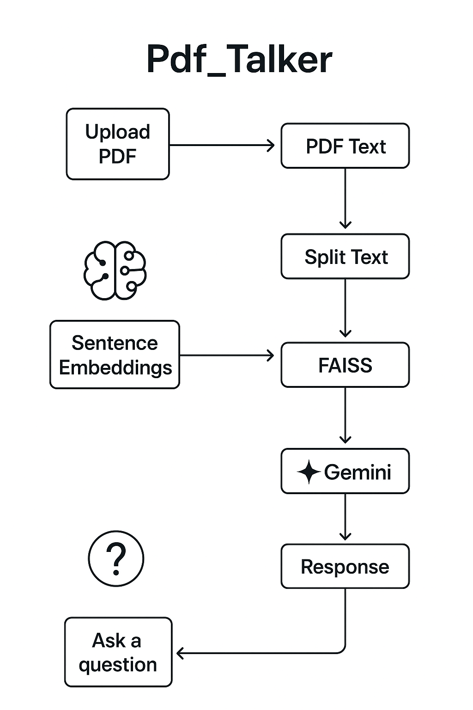

# PDF_Talker 📄💬

A powerful Python application that enables natural language querying of PDF documents using AI. Upload any PDF and ask questions about its content - the AI will provide accurate answers based solely on the document's information.

## ✨ Features

- 📤 **PDF Upload**: Simple drag-and-drop PDF upload interface
- 🧠 **AI-Powered**: Uses Google Gemini for intelligent question answering
- 🔍 **Semantic Search**: Local HuggingFace embeddings for accurate content retrieval
- ⚡ **Fast Performance**: FAISS vector store for lightning-fast similarity search
- 🎯 **Document-Focused**: Answers are strictly based on uploaded document content
- 🖥️ **User-Friendly**: Clean Streamlit web interface

## 🔄 How It Works

The application follows a sophisticated pipeline to process your PDF and answer questions:

```
[PDF Document] → [Text Chunks] → [Embeddings] → [FAISS Vector Store] → [Query Processing] → [Gemini LLM] → [AI Answer]
```


### Process Breakdown:

1. **PDF Processing**: Extracts and splits text into manageable chunks
2. **Embedding Generation**: Creates vector embeddings using local HuggingFace models
3. **Vector Storage**: Stores embeddings in FAISS for efficient retrieval
4. **Query Processing**: Converts user questions into searchable vectors
5. **Semantic Search**: Finds most relevant document chunks
6. **AI Generation**: Gemini processes relevant chunks to generate accurate answers

## 🛠️ Tech Stack

| Component | Technology | Purpose |
|-----------|------------|---------|
| **LLM** | Google Gemini | Answer generation |
| **Embeddings** | HuggingFace (`sentence-transformers/all-MiniLM-L6-v2`) | Local vector generation |
| **Vector Store** | FAISS | Fast similarity search |
| **Framework** | LangChain | AI workflow orchestration |
| **GUI** | Streamlit | Web interface |
| **Language** | Python 3.8+ | Core application |

## 🚀 Installation

### Prerequisites
- Python 3.8 or higher
- Google Gemini API key

### Setup Steps

1. **Clone the repository**
   ```bash
   git clone https://github.com/yourusername/pdf_talker.git
   cd pdf_talker
   ```

2. **Install dependencies**
   ```bash
   pip install -r requirements.txt
   ```

3. **Configure API Key**
   
   Create a `.env` file in the project root:
   ```env
   GEMINI_API_KEY=your_gemini_api_key_here
   ```
   
   > 💡 **Get your API key**: Visit [Google AI Studio](https://makersuite.google.com/app/apikey) to obtain your free Gemini API key

4. **Run the application**
   ```bash
   streamlit run app.py
   ```

5. **Open your browser**
   
   Navigate to `http://localhost:8501` to access the application

## 📝 Usage

1. **Upload PDF**: Use the file uploader to select your PDF document
2. **Wait for Processing**: The app will process and create embeddings (first-time setup may take a moment)
3. **Ask Questions**: Type your question in natural language
4. **Get Answers**: Receive AI-generated responses based on your document content

### Example Questions:
- "What is the main topic of this document?"
- "Summarize the key findings in chapter 3"
- "What are the conclusions mentioned?"
- "Explain the methodology used in this research"

## 🤝 Contributing

This repository is primarily for educational purposes and demonstrates building a "Ask your PDF" application. While not actively seeking contributions, feel free to:

- Fork the project for your own modifications
- Submit issues for bugs or suggestions  
- Use this as a learning resource for similar projects

**Built with ❤️ for the AI community**

*Happy PDF querying! 🎉*